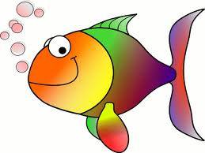
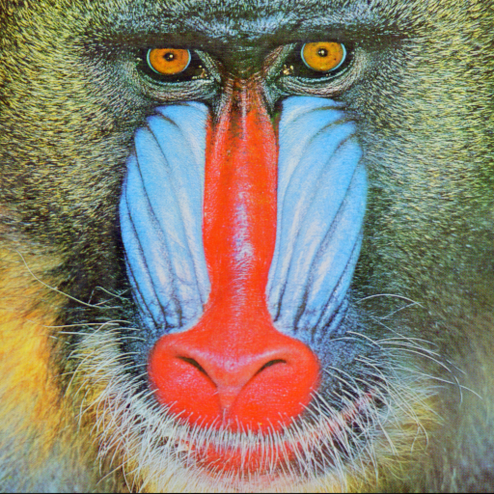
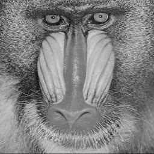
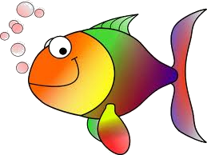
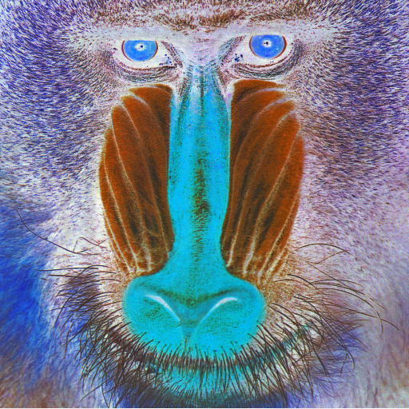
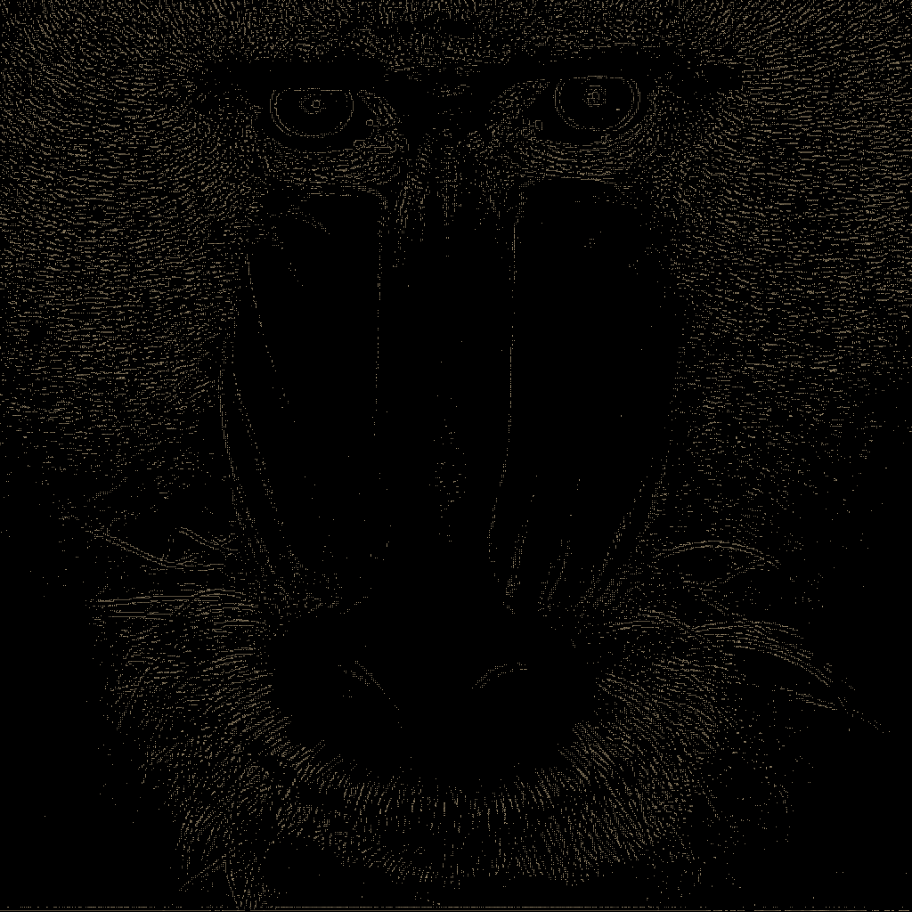
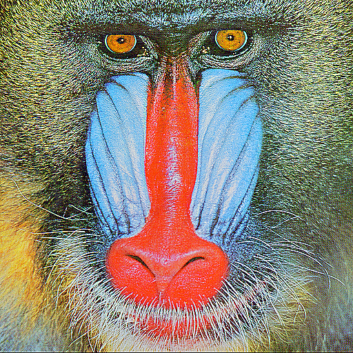

# ImageEditor PHP Package

The ImageEditor PHP package provides a convenient and flexible way to manipulate images using the GD extension. It allows you to perform various operations like resizing, applying filters, and saving images in different formats.

## Installation

Install the package via Composer:

`composer require ccmiller2018/image-editor`


## Requirements

- PHP 7.4 or higher
- GD extension enabled

## Usage

```php
use Ccmiller2018\ImageEditor\ImageEditor;

// Create an instance of ImageEditor
$imageEditor = new ImageEditor();

// Load an image from a file
$imageEditor->loadImage('path/to/image.jpg');

// Perform operations on the image
$imageEditor
    ->resize(300, 200)
    ->grayscale()
    ->saveTo('path/to/output.jpg');
```

## Available Methods

| Method Name       | Arguments                                                          | Returns     | Throws               | Fluent Method | Explanation                                                                                                                  |
|-------------------|--------------------------------------------------------------------|-------------|----------------------|---------------|------------------------------------------------------------------------------------------------------------------------------|
| getImage          | GDImage $image                                                     | ?GDImage    |                      |               | Gets the resulting image at that point                                                                                       |
| loadImage         | string $filePath                                                   | ImageEditor | ImageEditorException | Yes           | Loads into the class an image from a file                                                                                    |
| as                | string $type                                                       | ImageEditor | ImageEditorException | Yes           | Sets the target type for the end result.                                                                                     |
| saveTo            | string $path                                                       |             | ImageEditorException |               | Saves the resulting image at that point to a file                                                                            |
| resize            | int $width, int $height                                            | ImageEditor | ImageEditorException | Yes           | Resizes (using resampling) the image                                                                                         |
| sepia             |                                                                    | ImageEditor | ImageEditorException | Yes           | Applies a Sepia Filter                                                                                                       |
| removeBackground  | int $colourThreshold (default 30)                                  | ImageEditor | ImageEditorException | Yes           | Removes a background colour based on the average.  the threshold modifies the intensity                                      |
| negative          |                                                                    | ImageEditor | ImageEditorException | Yes           | Inverts the colours on the image                                                                                             |
| adjustBrightness  | int $brightnessValue (default 128)                                 | ImageEditor | ImageEditorException | Yes           | Increases / Decreases the brightness - brightness must be between -255 and 255                                               |
| adjustContrast    | int $contrastValue (default 128)                                   | ImageEditor | ImageEditorException | Yes           | Increases / Decreases the contrast of the image - contrastValue must be between -255 and 255                                 |
| colourOverlay     | int $red, int $green, int $blue, int $alpha (default 0)            | ImageEditor | ImageEditorException | Yes           | Applies a colour overlay to the image - red, green, blue and alpha must be between 0 and 255                                 |
| edgeDetection     |                                                                    | ImageEditor | ImageEditorException | Yes           | Enhances the edges of an image                                                                                               |
| emboss            |                                                                    | ImageEditor | ImageEditorException | Yes           | Embosses the image                                                                                                           |
| gaussianBlur      |                                                                    | ImageEditor | ImageEditorException | Yes           | Applies a gaussian Blur to the image                                                                                         |
| selectiveBlur     |                                                                    | ImageEditor | ImageEditorException | Yes           | Applies a selective Blur to the image                                                                                        |
| sketch            |                                                                    | ImageEditor | ImageEditorException | Yes           | Applies a sketch-like filter to the image                                                                                    |
| smooth            | int $smoothValue (default -6)                                      | ImageEditor | ImageEditorException | Yes           | Applies smoothing to the image                                                                                               |
| piexellate        | int $pixelSize (default 16), bool $advanced (default false)        | ImageEditor | ImageEditorException | Yes           | Applies a pixellization effect to the image                                                                                  |
| scatter           | int $subtractionLevel (default 8), int $additionLevel (default 10) | ImageEditor | ImageEditorException | Yes           | Applies a scatter effect, making it look like the image is breaking up.  Subtraction level must be lower than addition level |
| posterize         |                                                                    | ImageEditor | ImageEditorException | Yes           | Applies a posterization effect, making the image appear more simply drawn                                                    |
| sharpen           |                                                                    | ImageEditor | ImageEditorException | Yes           | Applies a sharpen effect, sharpening the image slightly                                                                      |
| customConvolution | array $matrix                                                      | ImageEditor | ImageEditorException | Y             | Applies a custom convolution matrix to the image, editing it in line with the matrix provided.  matrix must be a 3X3 array   |

## Using This Package: An In Depth Look

This package was entirely designed around the idea of being able to quickly and easily, in a fluent format. apply multiple filters to an image you might pass in.

Let's start at the easiest use case, and work up from there.

### Our Source Images:


`images/sources/baboon.png`  This is 512px X 512px

 

`images/sources/HappyFish.png` This is 259px X 194px
`
### Resizing an image

```php
<?php

declare(strict_types=1);

use Ccmiller2018\ImageEditor\ImageEditor;

require_once('vendor/autoload.php');

$editor = new ImageEditor();

$editor->loadImage('images/sources/baboon.jpg')
    ->resize(100, 100)
    ->saveTo('images/outputs/baboon-resize-100-100.jpg');
```

This takes in an image from a file resizes it to 100px X 100px, and saves it.  This uses resampling to ensure the best quality result.


`images/outputs/baboon-resize-100-100.png`  This is 100px X 100px

You can also sample up, thereby increasing the images size

```php
<?php

declare(strict_types=1);

use Ccmiller2018\ImageEditor\ImageEditor;

require_once('vendor/autoload.php');

$editor = new ImageEditor();

$editor->loadImage('images/sources/baboon.jpg')
    ->resize(1024, 1024)
    ->saveTo('images/outputs/baboon-resize-1024-1024.jpg');
```

This takes in an image from a file resizes it to 1024px X 1024px, and saves it.  This uses resampling to ensure the best quality result.



`images/outputs/baboon-resize-1024-1024.png`  This is 1024px X 1024px


## Converting the type of the image

```php
<?php

declare(strict_types=1);

use Ccmiller2018\ImageEditor\ImageEditor;

require_once('vendor/autoload.php');

$editor = new ImageEditor();

$editor->loadImage('images/sources/baboon.png')
    ->as('jpeg')
    ->saveTo('images/outputs/baboon.jpg');
```

This simply takes our baboon file, and saves it as jpeg.


`images/outputs/baboon.jpg`  This is 512px X 512px

## Making Our Image Grayscale

```php
<?php

declare(strict_types=1);

use Ccmiller2018\ImageEditor\ImageEditor;

require_once('vendor/autoload.php');

$editor = new ImageEditor();

$editor->loadImage('images/sources/baboon.png')
    ->grayscale()
    ->saveTo('images/outputs/baboon-grayscale.png');
```

Using grayscale filtering, this makes our image grayscale, very quickly.


`images/outputs/baboon-grayscale.png`  This is 512px X 512px

## Chaining Methods

```php
<?php

declare(strict_types=1);

use Ccmiller2018\ImageEditor\ImageEditor;

require_once('vendor/autoload.php');

$editor = new ImageEditor();

$editor->loadImage('images/sources/baboon.png')
    ->resize(256, 256)
    ->grayscale()
    ->as('jpeg')
    ->saveTo('images/outputs/baboon-grayscale-resize.jpg');
```

Methods can almost always be chained, for example - we can read our file, resize it, make it grayscale and save as jpeg:



`images/outputs/baboon.jpg`  This is 256px X 256px

## Removing the background

This is a more advanced filter, that detects the background colour, and removes it.  This will work in most circumstances.

```php
<?php

declare(strict_types=1);

use Ccmiller2018\ImageEditor\ImageEditor;

require_once('vendor/autoload.php');

$editor = new ImageEditor();

$editor->loadImage('images/sources/HappyFish.jpg')
    ->removeBackground()
    ->saveTo('images/outputs/HappyFish-remove-background.jpg');
```



`images/outputs/HappyFish-remove-background.jpg`

## Negative Images

This will find the direct inversion of every pixel in the image, and use that colour instead:

```php
<?php

declare(strict_types=1);

use Ccmiller2018\ImageEditor\ImageEditor;

require_once('vendor/autoload.php');

$editor = new ImageEditor();

$editor->loadImage('images/sources/baboon.png')
    ->negative()
    ->saveTo('images/outputs/baboon-negative.png');
```



`images/outputs/baboon-negative.png`

## Chaining Multiple Methods To Get The Result You Want

We're going to chain multiple methods here to make up an image we want from our source baboon.

```php
<?php

declare(strict_types=1);

use Ccmiller2018\ImageEditor\ImageEditor;

require_once('vendor/autoload.php');

$editor = new ImageEditor();

$editor->loadImage('images/sources/baboon.png')
    ->resize(1024, 1024)
    ->posterize()
    ->posterize()
    ->sketch()
    ->grayscale()
    ->adjustBrightness(-30)
    ->adjustContrast(30)
    ->negative()
    ->edgeDetection()
    ->removeBackground(120)
    ->negative()
    ->adjustBrightness(60)
    ->sepia()
    ->saveTo('images/outputs/baboon-complex.png');
```

This makes multiple adjustments to ensure we get the image we want in the end.



`images/outputs/baboon-complex.png`

## A Word About customConvolution

The `customConvolution` method in the ImageEditor class is used to apply a custom convolution matrix to the image. Convolution is a mathematical operation that combines two sets of information in order to produce a third set. In image processing, convolution is often used for applying various filters or effects to an image.

The purpose of the customConvolution method is to perform a convolution operation on the image using a custom 3x3 matrix provided as an argument.

Convolution is a technique commonly used in image processing for tasks like blurring, sharpening, edge detection, and more.

**Convolution Kernel:**

The convolution process starts with a small matrix known as the convolution kernel. In the context of image processing, this matrix is often a 3x3 matrix, although other sizes can also be used.
The elements of the kernel represent weights or coefficients.

**Sliding the Kernel:**

The convolution kernel is systematically slid over the entire image, pixel by pixel, starting from the top-left corner.
At each position, the center of the kernel is aligned with the current pixel being processed.

**Element-wise Multiplication:**

For each position, the elements of the kernel are multiplied element-wise with the corresponding pixel values in the image region covered by the kernel.
The result of each multiplication represents the contribution of that pixel to the final value of the output pixel.

**Summation:**

The products obtained from the element-wise multiplication are then summed up.
The sum represents the weighted combination of pixel values in the image region covered by the kernel.

**Normalization:**

In some cases, the sum is divided by a normalization factor (divisor) to ensure that the intensity values of the pixels in the resulting image stay within a reasonable range.
Normalization is often necessary to prevent the image from becoming too bright or too dark.

**Updating the Image:**

The result of the convolution operation becomes the new value of the pixel at the center of the kernel.

This process is repeated for every pixel in the image, resulting in a new image that reflects the effects of the convolution operation.

**Border Handling:**

Handling borders is a consideration in convolution, especially when the kernel extends beyond the boundaries of the image.
There are different approaches to border handling, such as zero-padding, edge replication, or using mirrored values.

**Effect on Image:**

The choice of values in the convolution kernel determines the nature of the image processing effect applied. Different kernels produce different effects, such as blurring, sharpening, edge detection, and more.


## A Custom Convolution example

```php
<?php

declare(strict_types=1);

use Ccmiller2018\ImageEditor\ImageEditor;

require_once('vendor/autoload.php');

$editor = new ImageEditor();

$matrix = [
    [0,-100,0],
    [-100,500,-100],
    [0,-100,0]
];

$editor->loadImage('images/sources/baboon.png')
    ->customConvolution($matrix)
    ->saveTo('images/outputs/baboon-custom-convolution.png');
```



`images/outputs/baboon-custom-convolution.png`